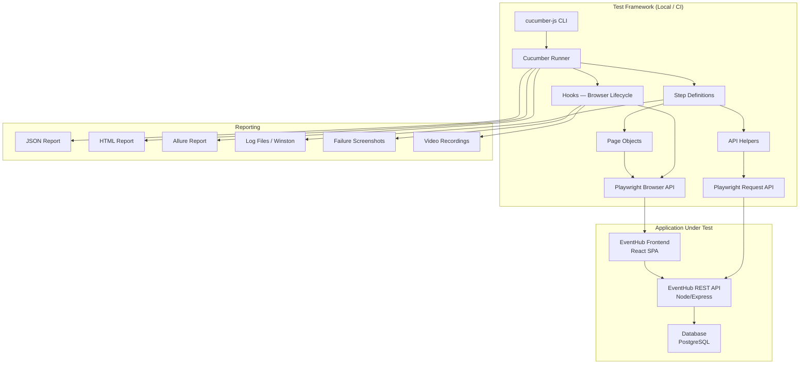
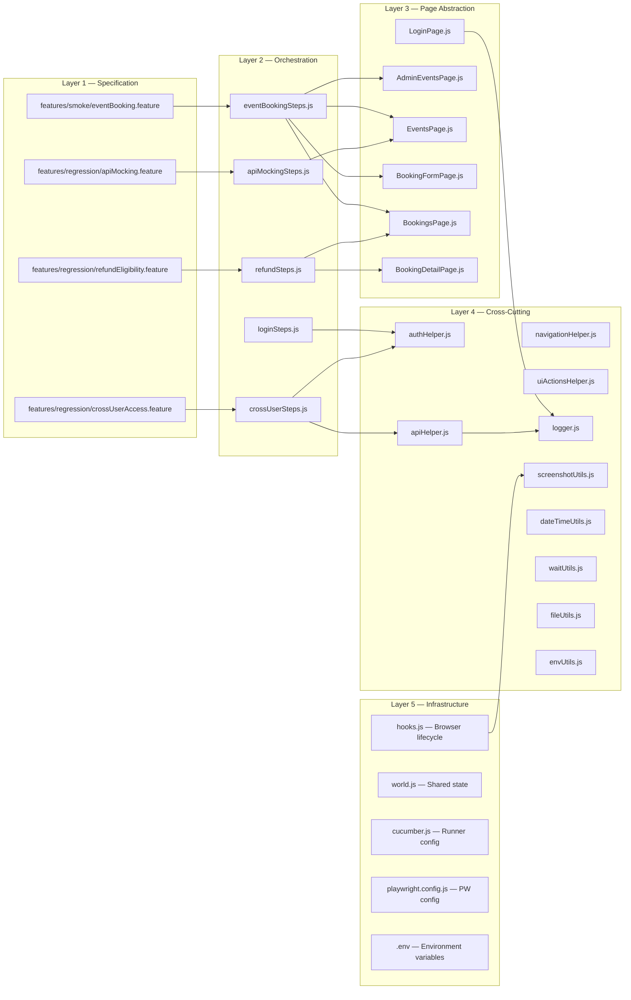
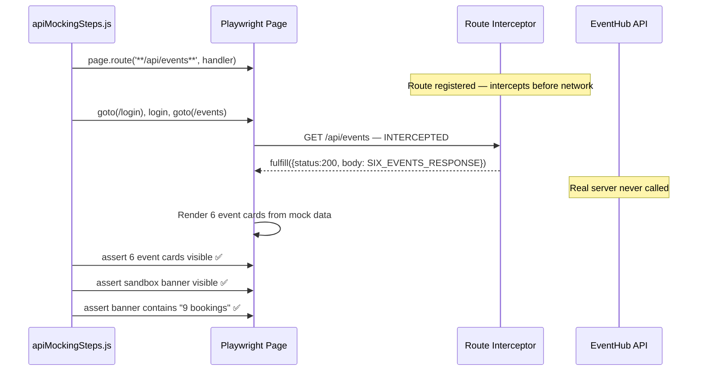
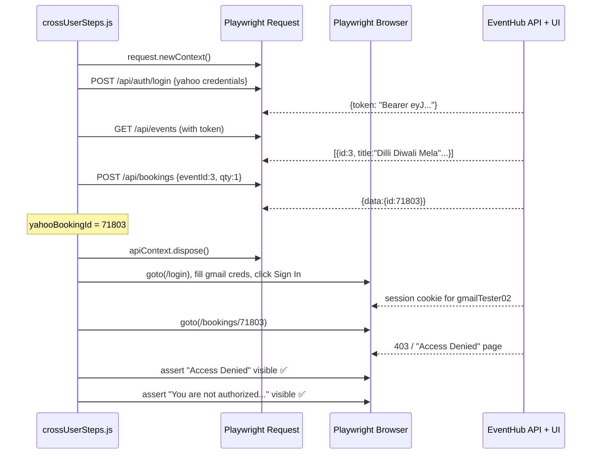
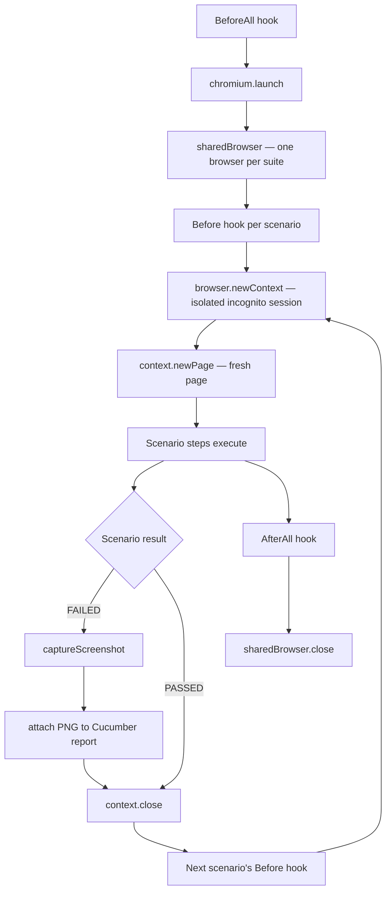
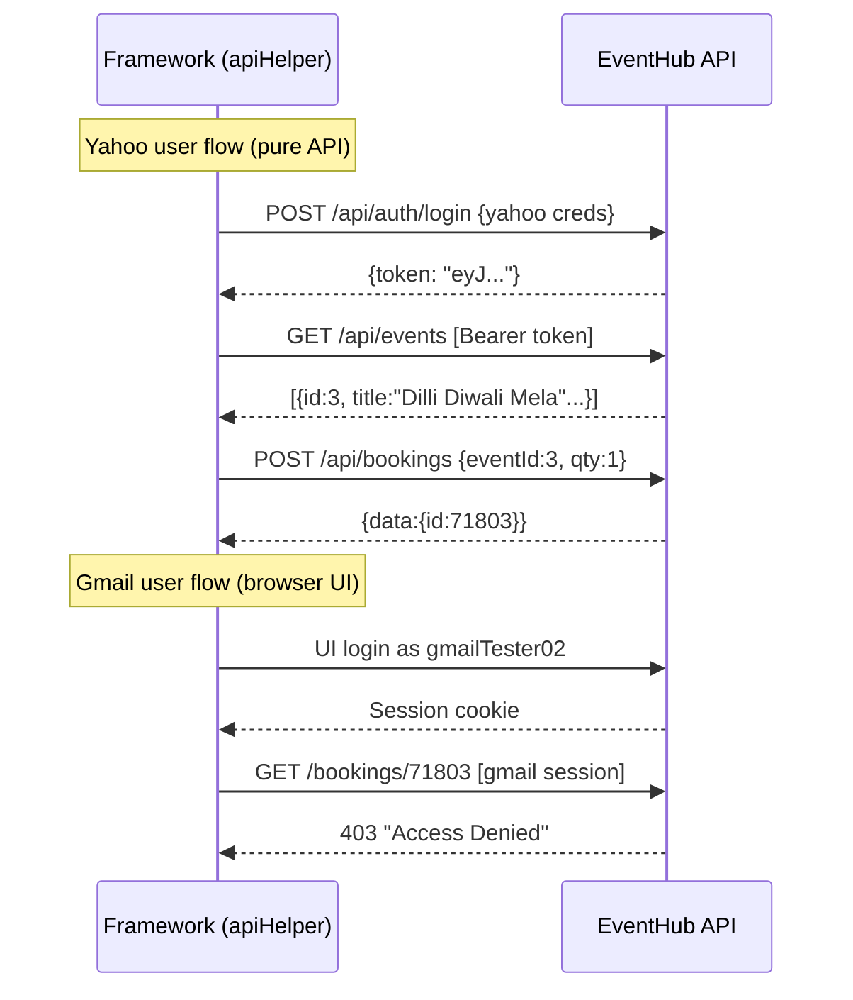
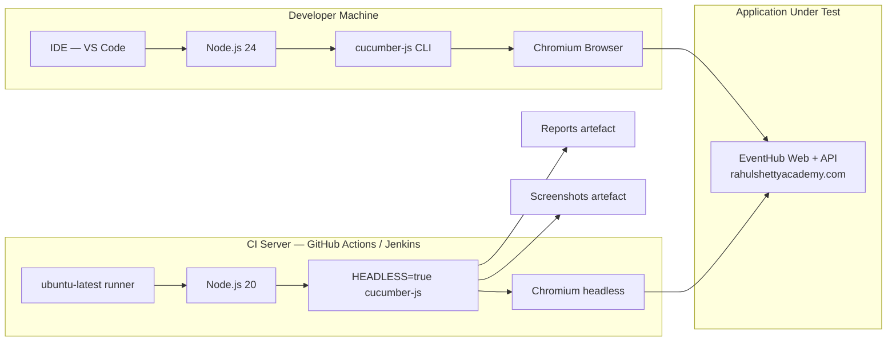
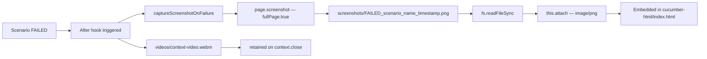

# EventHub — Enterprise Playwright + Cucumber BDD Automation Framework
## Complete Technical Documentation Package

---

## Table of Contents

1. [Project Overview](#1-project-overview)
2. [Complete System Architecture](#2-complete-system-architecture)
3. [Technology Stack](#3-technology-stack)
4. [Implementation Details](#4-implementation-details)
5. [API Documentation](#5-api-documentation)
6. [Test Data & Constants](#6-test-data--constants)
7. [Infrastructure & Environment](#7-infrastructure--environment)
8. [Security](#8-security)
9. [Testing — All Four Setups](#9-testing--all-four-setups)
10. [Monitoring and Logging](#10-monitoring-and-logging)
11. [Reports](#11-reports)
12. [Client Demo Preparation](#12-client-demo-preparation)
13. [Developer Knowledge Transfer](#13-developer-knowledge-transfer)
14. [Interview & Demo Q&A](#14-interview--demo-qa)

---

## 1. Project Overview

### 1.1 Business Objective

Build a production-grade, maintainable, and scalable automated test framework for the **EventHub** web application — a ticket booking platform used by QA engineers to practise real-world automation scenarios. The framework demonstrates enterprise-level quality assurance practices for a client audience evaluating automation competency.

### 1.2 Problem Statement

| Problem | Impact |
|---|---|
| Manual regression cycles take days | Release velocity is blocked |
| No systematic API-layer validation | Backend bugs reach production |
| No cross-user security testing | Authorisation flaws go undetected |
| No network-layer interception | Frontend rendering logic is untestable in isolation |
| No structured reporting | QA results are invisible to stakeholders |

### 1.3 Solution Overview

An **enterprise-grade, BDD-first automation framework** that combines:

- **Playwright** for browser automation (UI + network layer)
- **Cucumber** for business-readable Gherkin test specifications
- **Page Object Model (POM)** for maintainable UI abstractions
- **REST API helpers** for out-of-browser setup and cross-user scenarios
- **Winston logging** for full traceability
- **HTML + JSON reports** for stakeholder visibility

### 1.4 Key Features

| Feature | Description |
|---|---|
| BDD Gherkin Specs | Tests written in plain English, readable by non-technical stakeholders |
| Page Object Model | Every page = one class; locators never duplicated |
| Cross-layer Testing | Same framework covers UI, REST API, and network interception |
| Smart Event Picker | Dynamically finds events with sufficient seats — immune to sandbox depletion |
| Failure Evidence | Automatic full-page screenshots embedded in Cucumber HTML reports |
| Video Recording | Every scenario records a `.webm` video file on failure |
| Structured Logging | Winston logs written to console + daily log files |
| Multi-profile Reporting | Separate smoke / regression / full-suite HTML + JSON reports |
| Environment-driven | Zero hard-coding — all config via `.env` with sensible defaults |
| Multi-user Testing | Three independent sandbox accounts for cross-user security assertions |

### 1.5 Target Users

| Persona | Role |
|---|---|
| QA Engineer | Writes and maintains test specs; runs suite locally |
| SDET | Builds new page objects and step definitions |
| Dev Lead / Client | Reviews HTML reports and Allure dashboards |
| CI/CD Pipeline | Runs `npm test` on each commit and publishes reports |

### 1.6 Project Architecture Summary

```
Test Specs (Gherkin .feature files)
         ↓
Step Definitions (thin orchestration layer)
         ↓
Page Objects  ←→  Helpers  ←→  Utils
         ↓               ↓
    Playwright API    Playwright Request
    (Browser UI)      (REST calls)
         ↓
    Application Under Test
    https://eventhub.rahulshettyacademy.com
```

---

## 2. Complete System Architecture

### 2.1 High-Level Architecture



### 2.2 Low-Level Architecture — Layer Breakdown



### 2.3 Scenario Execution Sequence — Setup 1 (Create & Book)

```mermaid
sequenceDiagram
    participant CW as Cucumber Runner
    participant HK as hooks.js
    participant SD as eventBookingSteps.js
    participant PG as AdminEventsPage / EventsPage
    participant PW as Playwright Browser
    participant APP as EventHub App

    CW->>HK: BeforeAll — launch chromium
    CW->>HK: Before — newContext + newPage
    CW->>SD: Given I am logged in to EventHub
    SD->>PW: goto(/login), fill email+pw, click Sign In
    PW->>APP: POST /api/auth/login
    APP-->>PW: 200 OK + session cookie
    SD->>PW: assert Browse Events link visible
    CW->>SD: When I navigate to the admin events page
    SD->>PW: goto(/admin/events)
    CW->>SD: And I create a new unique test event
    SD->>PG: createEvent({title, date, seats...})
    PG->>PW: click #add-event-btn, fill form fields, submit
    PW->>APP: POST /api/events
    APP-->>PW: toast "Event created!"
    CW->>SD: When I capture the seat count before booking
    SD->>PG: getSeatCount(card) → 50
    CW->>SD: And I click Book Now on the event card
    PW->>APP: navigate to /events/{id}/book
    CW->>SD: When I confirm the booking
    PW->>APP: POST /api/bookings
    APP-->>PW: redirect to confirmation page
    CW->>SD: Then the seat count should be exactly 1 less
    SD->>PG: getSeatCount(card) → 49
    SD->>SD: assert 49 === 50 - 1 ✅
    CW->>HK: After — close context
    CW->>HK: AfterAll — close browser
```



### 2.4 Scenario Execution Sequence — Setup 3 (API Mocking)



### 2.5 Scenario Execution Sequence — Setup 4 (Cross-User Access)



### 2.6 Browser Lifecycle Architecture



Key design decision: **one shared browser, one context per scenario**. This:
- Eliminates the 2-3 second browser launch overhead per scenario
- Gives each scenario a clean, isolated cookie/localStorage state
- Prevents test cross-contamination

---

## 3. Technology Stack

### 3.1 Core Testing Technologies

| Technology | Version | Role | Why Chosen |
|---|---|---|---|
| **Playwright** | 1.44.0 | Browser automation engine | Cross-browser, auto-wait, built-in network interception, video recording, trace viewer |
| **@cucumber/cucumber** | 10.9.0 | BDD test runner | Enables Gherkin specs, readable by business stakeholders, tag-based filtering |
| **Node.js** | 24.x | Runtime | JavaScript ecosystem, async/await first-class, no compilation step |

### 3.2 Reporting

| Technology | Version | Role | Why Chosen |
|---|---|---|---|
| **multiple-cucumber-html-reporter** | 3.10.0 | HTML dashboard from JSON | Rich UI, embedded screenshots, scenario-level drill-down |
| **allure-cucumberjs** | 2.15.1 | Allure integration | Industry-standard report format, supports attachments and categories |
| **allure-commandline** | 2.43.0 | Allure CLI (devDep) | Generates and opens Allure HTML report |
| Cucumber built-in JSON | — | Machine-readable output | CI artifact, input for HTML reporter |
| Cucumber built-in HTML | — | Quick per-run HTML | Fast local review without extra tooling |

### 3.3 Utilities

| Technology | Version | Role | Why Chosen |
|---|---|---|---|
| **winston** | 3.19.0 | Structured logging | Multiple transports (console + file), configurable log level, colorized output |
| **dotenv** | 16.6.1 | Environment variable loading | Industry standard; keeps secrets out of code |
| **rimraf** | 5.0.10 | Cross-platform `rm -rf` | Clean reports/screenshots between runs on Windows & Linux |

### 3.4 Application Under Test Technologies

The **EventHub** application (external, not owned by this framework) uses:

| Layer | Technology |
|---|---|
| Frontend | React SPA (Single Page Application) |
| Backend API | Node.js / Express REST API |
| Auth | JWT (JSON Web Tokens) — `Bearer eyJ...` in `Authorization` header |
| API Base URL | `https://api.eventhub.rahulshettyacademy.com/api` |
| UI Base URL | `https://eventhub.rahulshettyacademy.com` |

### 3.5 Technology Choice Rationale — Deep Dive

**Why Playwright over Selenium?**
- Built-in auto-wait: eliminates explicit `sleep()` calls
- Native network interception (`page.route()`) — Selenium requires a proxy
- Video recording and trace viewer built-in
- Locator stability: roles, labels, test IDs > fragile CSS paths
- `request.newContext()` for REST API calls within same framework

**Why Cucumber (BDD) over pure Playwright test runner?**
- Feature files are readable by QA managers and clients who cannot read code
- Tags (`@smoke`, `@regression`, `@setup1`) allow precise suite targeting
- Scenarios map directly to user stories / acceptance criteria
- CustomWorld provides structured shared state across steps

**Why Page Object Model?**
- Locators defined once; changes require edits in one class only
- Step definitions stay thin (orchestration only, no raw Playwright calls)
- Pages are independently testable units

**Why Winston over `console.log`?**
- Persistent daily log files for post-mortem analysis
- Log levels (`info`, `warn`, `error`) configurable without code changes
- Structured format with timestamps

---

## 4. Implementation Details

### 4.1 Project Folder Structure

```
Project/
├── .env                          # Environment variables (never committed)
├── cucumber.js                   # Cucumber runner configuration
├── playwright.config.js          # Playwright config (for native PW runner)
├── package.json                  # Dependencies and npm scripts
│
├── features/                     # All BDD artefacts
│   ├── hooks/
│   │   ├── world.js              # CustomWorld — shared state container
│   │   └── hooks.js              # BeforeAll/AfterAll/Before/After lifecycle
│   ├── smoke/
│   │   └── eventBooking.feature  # Setup 1: Create → Book → Verify seats
│   ├── regression/
│   │   ├── refundEligibility.feature   # Setup 2: Refund eligibility
│   │   ├── apiMocking.feature          # Setup 3: Network interception
│   │   └── crossUserAccess.feature     # Setup 4: Cross-user security
│   └── step-definitions/
│       ├── loginSteps.js         # Given I am logged in
│       ├── eventBookingSteps.js  # All event listing, form, booking steps
│       ├── refundSteps.js        # Booking detail + refund eligibility steps
│       ├── apiMockingSteps.js    # Route interception steps
│       └── crossUserSteps.js     # API login + access-denied steps
│
├── pages/                        # Page Object Model classes
│   ├── LoginPage.js
│   ├── AdminEventsPage.js
│   ├── EventsPage.js
│   ├── BookingFormPage.js
│   ├── BookingsPage.js
│   └── BookingDetailPage.js
│
├── helpers/                      # Reusable business-level helpers
│   ├── authHelper.js             # login(), loginAs(), loginAndGoToEvents()
│   ├── apiHelper.js              # apiLogin(), getFirstEventId(), createBookingViaApi()
│   ├── navigationHelper.js       # goToEvents(), goToBookings(), etc.
│   └── uiActionsHelper.js        # clickAndWait(), fillAndTab(), getText(), etc.
│
├── utils/                        # Pure utility modules
│   ├── logger.js                 # Winston logger singleton
│   ├── screenshotUtils.js        # captureScreenshot(), captureScreenshotOnFailure()
│   ├── dateTimeUtils.js          # futureDateValue(), uniqueSuffix(), etc.
│   ├── waitUtils.js              # waitForVisible(), pollUntil(), waitForUrl()
│   ├── fileUtils.js              # readJson(), writeJson(), ensureDir()
│   └── envUtils.js               # getEnv(), getBaseUrl(), getApiUrl()
│
├── test-data/
│   ├── constants.js              # USERS, MESSAGES, SIX_EVENTS_RESPONSE, FOUR_EVENTS_RESPONSE
│   ├── users.json                # User credentials for form filling
│   └── eventData.json            # Default event creation data
│
├── reports/                      # Generated at runtime (git-ignored)
│   ├── cucumber-report.json
│   ├── cucumber-html/index.html
│   ├── smoke-report.json
│   └── regression-report.json
│
├── screenshots/                  # Failure screenshots (git-ignored)
├── videos/                       # Scenario video recordings (git-ignored)
├── logs/                         # Winston log files (git-ignored)
└── traces/                       # Playwright trace files (git-ignored)
```

### 4.2 Design Patterns Used

#### 4.2.1 Page Object Model (POM)

Every UI page is represented by a class. The class constructor receives the Playwright `page` object and defines all locators as instance properties. Methods represent user actions.

```js
// Pattern: constructor defines locators, methods express behaviour
class BookingFormPage {
  constructor(page) {
    this.incrementBtn = page.locator('button').filter({ hasText: '+' });
    this.confirmBtn   = page.locator('.confirm-booking-btn');
  }
  async increaseTicketCount(times = 1) {
    await this.incrementBtn.scrollIntoViewIfNeeded();
    await this.incrementBtn.waitFor({ state: 'visible', timeout: 15000 });
    for (let i = 0; i < times; i++) { await this.incrementBtn.click(); }
  }
}
```

#### 4.2.2 CustomWorld (Cucumber Shared State)

Cucumber's `World` is extended to carry scenario-scoped state between steps without using module-level globals.

```js
class CustomWorld extends World {
  constructor(options) {
    super(options);
    this.page              = null;   // Playwright page — set in Before hook
    this.context           = null;   // Playwright BrowserContext
    this.eventTitle        = '';     // Set in create-event step, read in verify-seats step
    this.seatsBeforeBooking = 0;
    this.seatsAfterBooking  = 0;
    this.bookingRef         = '';
    this.yahooBookingId     = '';
  }
}
```

#### 4.2.3 Helper / Facade Pattern

Helpers combine multiple page-object operations into higher-level business actions, removing repetition from step definitions.

```js
// authHelper.js — Facade over LoginPage
async function login(page) {
  const loginPage = new LoginPage(page);
  await loginPage.login(DEFAULT_EMAIL, DEFAULT_PASSWORD);
  await loginPage.assertLoginSuccess();
}
```

#### 4.2.4 Factory / Builder — Event Creation

`AdminEventsPage.createEvent()` acts as a builder: callers pass a single config object; the method orchestrates the multi-field form in the correct order.

#### 4.2.5 Strategy Pattern — Smart Event Picker

The `I click Book Now on the first available event card with at least {int} seats` step uses a runtime strategy: it iterates cards and picks the first that satisfies the minimum-seat constraint, rather than always picking the first card.

```js
for (let i = 0; i < cardCount; i++) {
  const seats = parseSeatCount(card[i]);
  if (seats >= minSeats) { await clickBookNow(card[i]); return; }
}
```

### 4.3 Locator Strategy — Reliability Hierarchy

The framework follows Playwright's recommended locator priority:

| Priority | Strategy | Example |
|---|---|---|
| 1 — Best | `getByRole` (ARIA semantic) | `page.getByRole('link', { name: 'Browse Events' })` |
| 2 — Good | `getByLabel` (form fields) | `page.getByLabel('Password')` |
| 3 — Good | `getByTestId` (`data-testid`) | `page.getByTestId('check-refund-btn')` |
| 4 — OK | `getByPlaceholder` | `page.getByPlaceholder('you@email.com')` |
| 5 — Avoid | CSS ID selectors | `page.locator('#login-btn')` — only for very stable IDs |
| Never | XPath | — |

**Key locator discoveries and fixes:**
- `Browse Events` link appears twice (nav + footer) — use `.first()`
- Booking ref on **confirmation page**: `.booking-ref` class
- Booking ref on **bookings list page**: `.booking-ref` class
- Booking ref on **booking detail page**: `.font-mono` class (different!)
- Increment `+` button: `page.locator('button').filter({ hasText: '+' })` (not `:has-text` CSS pseudo-class)
- Refund button: `page.getByTestId('check-refund-btn')`

### 4.4 Cucumber Configuration (`cucumber.js`)

Three profiles defined:

| Profile | Command | Feature Path | Tags | Output |
|---|---|---|---|---|
| `default` | `npm test` | `features/**/*.feature` | none | `reports/cucumber-report.json` + HTML |
| `smoke` | `npm run test:smoke` | `features/smoke/**/*.feature` | `@smoke` | `reports/smoke-report.json` + HTML |
| `regression` | `npm run test:regression` | `features/regression/**/*.feature` | `@regression` | `reports/regression-report.json` + HTML |

Tag-based suite selection (no profile needed):
```
npx cucumber-js --tags @setup1
npx cucumber-js --tags @setup2
npx cucumber-js --tags "@smoke or @setup3"
```

### 4.5 Coding Standards

- `'use strict'` at top of every module
- CommonJS (`require` / `module.exports`) — no ESM — consistent with Cucumber 10 defaults
- `async/await` throughout — no callbacks, no `.then()` chains
- Class names: `PascalCase` (pages, world)
- Function names: `camelCase`
- Constants: `UPPER_SNAKE_CASE`
- File names: `camelCase.js` (utilities, helpers, steps), `PascalCase.js` (pages)
- No inline `setTimeout` — use Playwright's built-in wait mechanisms
- Logger over `console.log` everywhere

### 4.6 Error Handling

- Playwright throws on timeout — errors bubble to Cucumber, which marks step `FAILED`
- Manual assertion errors are thrown as `new Error(message)` — Cucumber captures stack trace
- API calls: `if (!res.ok()) throw new Error(...)` — never silently swallow HTTP errors
- `captureScreenshotOnFailure` is wrapped in `try/catch` so a secondary screenshot failure does not mask the original test failure

---

## 5. API Documentation

The framework tests the EventHub REST API at:  
`https://api.eventhub.rahulshettyacademy.com/api`

Swagger/OpenAPI docs available at:  
`https://api.eventhub.rahulshettyacademy.com/api/docs`

### 5.1 Authentication — POST /auth/login

**Purpose:** Obtain a JWT for subsequent authenticated API calls.

**Request:**
```http
POST /api/auth/login
Content-Type: application/json

{
  "email": "yahootester01@yahoo.com",
  "password": "Tester@123"
}
```

**Response (200 OK):**
```json
{
  "success": true,
  "token": "eyJhbGciOiJIUzI1NiIsInR5cCI6IkpXVCJ9...",
  "data": { "id": 42, "email": "yahootester01@yahoo.com" }
}
```

**Response (400 — invalid credentials):**
```json
{
  "success": false,
  "error": "Invalid email or password",
  "details": []
}
```

**Framework usage:**
```js
// helpers/apiHelper.js
const res = await request.post(`${API_URL}/auth/login`, {
  data: { email: credentials.email, password: credentials.password },
});
const token = body.token || body.data?.token;
```

### 5.2 Registration — POST /auth/register

**Purpose:** Create a new sandbox account.

**Request:**
```http
POST /api/auth/register
Content-Type: application/json

{
  "email": "yahootester01@yahoo.com",
  "password": "Tester@123"
}
```

**Response (200 OK):** Redirects to home page (registration handled via UI in the framework).

### 5.3 List Events — GET /api/events

**Purpose:** Fetch all events (used in Setup 4 to get a bookable event ID).

**Request:**
```http
GET /api/events
Authorization: Bearer eyJhbGci...
```

**Response (200 OK):**
```json
{
  "data": [
    {
      "id": 3,
      "title": "Dilli Diwali Mela",
      "category": "Festival",
      "eventDate": "2025-10-20T17:00:00.000Z",
      "venue": "Pragati Maidan Exhibition Grounds",
      "city": "Delhi",
      "price": "300",
      "totalSeats": 10000,
      "availableSeats": 2
    }
  ],
  "pagination": { "page": 1, "total": 8, "totalPages": 1, "limit": 12 }
}
```

### 5.4 Create Booking — POST /api/bookings

**Purpose:** Book tickets for an event programmatically (used in Setup 4 to create Yahoo user's booking).

**Request:**
```http
POST /api/bookings
Authorization: Bearer eyJhbGci...
Content-Type: application/json

{
  "eventId": 3,
  "customerName": "Yahoo User",
  "customerEmail": "yahootester01@yahoo.com",
  "customerPhone": "9876543210",
  "quantity": 1
}
```

**Response (200 OK):**
```json
{
  "success": true,
  "data": {
    "id": 71803,
    "bookingRef": "D-ABCXYZ",
    "eventId": 3,
    "userId": 42,
    "quantity": 1,
    "totalAmount": 300
  }
}
```

**Framework usage:**
```js
const bookingId = body.data?.id || body.id;
// → stored as this.yahooBookingId in CustomWorld
```

### 5.5 API Flow Diagram — Setup 4



---

## 6. Test Data & Constants

### 6.1 User Accounts

| Role | Email | Password | Purpose |
|---|---|---|---|
| Primary | `perumaltester@gmail.com` | `Tester@123` | Setup 1, 2, 3 — main test user |
| Yahoo | `yahootester01@yahoo.com` | `Tester@123` | Setup 4 — creates booking via API |
| Gmail | `gmailTester02@gmail.com` | `Tester@123` | Setup 4 — attempts to view Yahoo's booking |

All three accounts are registered on the EventHub sandbox environment.

### 6.2 Event Data (`test-data/eventData.json`)

```json
{
  "newEvent": {
    "description": "An automated test event created by the framework",
    "city": "Bangalore",
    "venue": "Test Venue, Koramangala",
    "price": 100,
    "totalSeats": 50
  },
  "bookingCustomer": {
    "name": "Test Automation User",
    "email": "perumaltester@gmail.com",
    "phone": "+91 9876543210"
  }
}
```

### 6.3 Mock API Response (`test-data/constants.js`)

`SIX_EVENTS_RESPONSE` — used in Setup 3 to intercept `/api/events` and return exactly 6 events, triggering the sandbox banner:

```js
const SIX_EVENTS_RESPONSE = {
  data: [
    { id: 1, title: 'Tech Summit 2025',   city: 'Hyderabad', availableSeats: 150 },
    { id: 2, title: 'Rock Night Live',    city: 'Bangalore', availableSeats: 300 },
    { id: 3, title: 'IPL Finals',         city: 'Bangalore', availableSeats: 50  },
    { id: 4, title: 'UX Design Workshop', city: 'Mumbai',    availableSeats: 20  },
    { id: 5, title: 'Lollapalooza India', city: 'Mumbai',    availableSeats: 2000},
    { id: 6, title: 'AI & ML Expo',       city: 'Bangalore', availableSeats: 180 },
  ],
  pagination: { page: 1, totalPages: 1, total: 6, limit: 12 }
};
```

**Why exactly 6?** The EventHub sandbox UI renders a banner — "This sandbox holds up to 9 bookings" — only when the API returns exactly 6 or more events. The mock tests this rendering condition in isolation without depending on live event count.

### 6.4 Application Messages (`MESSAGES` constant)

```js
const MESSAGES = {
  EVENT_CREATED:            'Event created!',
  BOOKING_CONFIRMED:        'Booking Confirmed!',
  ACCESS_DENIED:            'Access Denied',
  NOT_AUTHORIZED:           'You are not authorized to view this booking',
  ELIGIBLE_FOR_REFUND:      'Eligible for refund',
  SINGLE_TICKET_REFUND_MSG: 'Single-ticket bookings qualify for a full refund',
  NOT_ELIGIBLE_FOR_REFUND:  'Not eligible for refund',
  GROUP_BOOKING_REFUND_MSG: 'Group bookings (3 tickets) are non-refundable',
};
```

---

## 7. Infrastructure & Environment

### 7.1 Environment Configuration (`.env`)

```ini
# Application URLs
BASE_URL=https://eventhub.rahulshettyacademy.com
API_URL=https://api.eventhub.rahulshettyacademy.com/api

# Primary test account
USER_EMAIL=perumaltester@gmail.com
USER_PASSWORD=Tester@123

# Secondary accounts for Setup-4
YAHOO_EMAIL=yahootester01@yahoo.com
YAHOO_PASSWORD=Tester@123
GMAIL_EMAIL=gmailTester02@gmail.com
GMAIL_PASSWORD=Tester@123

# Browser settings
BROWSER=chromium
HEADLESS=false        # Set to true in CI
SLOW_MO=0             # Set to e.g. 500 for debugging

# Timeouts (ms)
DEFAULT_TIMEOUT=30000
NAVIGATION_TIMEOUT=60000

# Reporting directories
ALLURE_RESULTS_DIR=allure-results
CUCUMBER_REPORT_DIR=reports/cucumber-html
PLAYWRIGHT_HTML_DIR=reports/playwright-html

# Logging
LOG_LEVEL=info
LOG_DIR=logs
```

**Loading mechanism:** `require('dotenv').config()` called at the top of `hooks.js`, `authHelper.js`, `apiHelper.js`, and `playwright.config.js` — no separate bootstrap step required.

### 7.2 NPM Scripts

| Script | Command | Description |
|---|---|---|
| `npm test` | `cucumber-js` | Full suite — all features |
| `npm run test:smoke` | `cucumber-js --tags @smoke` | Smoke suite only |
| `npm run test:regression` | `cucumber-js --tags @regression` | Regression suite only |
| `npm run test:setup1` | `cucumber-js --tags @setup1` | Setup 1 scenario only |
| `npm run test:setup2` | `cucumber-js --tags @setup2` | Setup 2 scenarios only |
| `npm run test:setup3` | `cucumber-js --tags @setup3` | Setup 3 scenario only |
| `npm run test:setup4` | `cucumber-js --tags @setup4` | Setup 4 scenario only |
| `npm run report:allure` | `allure generate + allure open` | Generate and open Allure report |
| `npm run clean` | `rimraf reports screenshots videos traces logs allure-results allure-report` | Wipe all generated artefacts |

### 7.3 CI/CD Integration (Recommended Pipeline)

```yaml
# Example: GitHub Actions
name: Playwright BDD Suite
on: [push, pull_request]
jobs:
  test:
    runs-on: ubuntu-latest
    steps:
      - uses: actions/checkout@v4
      - uses: actions/setup-node@v4
        with: { node-version: '20' }
      - run: npm install
      - run: npx playwright install chromium --with-deps
      - run: npm test
        env:
          HEADLESS: true
          BASE_URL: ${{ secrets.BASE_URL }}
          USER_EMAIL: ${{ secrets.USER_EMAIL }}
          USER_PASSWORD: ${{ secrets.USER_PASSWORD }}
          YAHOO_EMAIL: ${{ secrets.YAHOO_EMAIL }}
          YAHOO_PASSWORD: ${{ secrets.YAHOO_PASSWORD }}
          GMAIL_EMAIL: ${{ secrets.GMAIL_EMAIL }}
          GMAIL_PASSWORD: ${{ secrets.GMAIL_PASSWORD }}
      - uses: actions/upload-artifact@v4
        if: always()
        with:
          name: test-reports
          path: |
            reports/
            screenshots/
            videos/
            logs/
```

### 7.4 Deployment Architecture



### 7.5 Video Recording Configuration

Set in `hooks.js — Before`:
```js
this.context = await sharedBrowser.newContext({
  recordVideo: { dir: 'videos/' },
  viewport: { width: 1280, height: 720 },
});
```

Every scenario records a `.webm` video file in `videos/`. Videos persist when the context closes.

---

## 8. Security

### 8.1 Credential Management

| Practice | Implementation |
|---|---|
| No hardcoded credentials in source | All credentials in `.env` |
| `.env` in `.gitignore` | Never committed to version control |
| CI secrets | GitHub Actions Secrets / Jenkins credentials |
| Test credentials | Dedicated sandbox accounts — not production |

### 8.2 Cross-User Access Control (Setup 4)

The framework **validates** the application's authorization model:

```
Yahoo user creates booking B → gets booking URL /bookings/71803
Gmail user (different session) attempts GET /bookings/71803
Expected: 403 "Access Denied" — only the booking owner may view it
```

This demonstrates that the framework is capable of **security regression testing** — detecting if a future code change accidentally exposes a user's bookings to others.

### 8.3 API Security Headers Tested

```js
// Setup 4 — Bearer token required for API calls
headers: { Authorization: `Bearer ${token}` }
```

The framework tests that:
1. Unauthenticated API calls fail (token required)
2. A valid token for User A cannot access User B's resources (authorisation check)

### 8.4 OWASP Considerations Demonstrated

| OWASP Category | How Framework Addresses It |
|---|---|
| Broken Object Level Authorization (BOLA) | Setup 4 explicitly tests cross-user booking access |
| Sensitive Data Exposure | No credentials in code or reports |
| Security Misconfiguration | Environment-driven config prevents hardcoded secrets |

---

## 9. Testing — All Four Setups

### 9.1 Setup 1 — Create Event → Book → Verify Seat Reduction

**Tag:** `@smoke @setup1`  
**Feature File:** `features/smoke/eventBooking.feature`  
**Test Type:** End-to-end integration (Admin + User flows)

**Business Rule Tested:** When a ticket is booked, the event's available seat count must decrease by exactly 1.

**Steps:**
1. Log in as primary user
2. Navigate to Admin → Events → click "Add Event"
3. Fill form: unique title (using `Date.now()` timestamp), description, city, venue, future date, price, seats (50)
4. Submit → assert toast "Event created!"
5. Navigate to `/events` → find newly created event card
6. Read and store seat count (50)
7. Click "Book Now" on that specific card
8. Assert ticket defaults to 1 → fill name/email/phone → confirm
9. Store booking reference from `.booking-ref`
10. Navigate to `/bookings` → verify card contains ref and event title
11. Navigate back to events → find card again → read seat count (49)
12. Assert: `seatsAfter === seatsBefore - 1`

**Key Locator — Event Card (specific event):**
```js
getCardByTitle(eventTitle) {
  return this.allEventCards.filter({ hasText: eventTitle });
}
```

**Key Locator — Unique Event Title:**
```js
this.eventTitle = `Test Event ${Date.now()}`;
// → "Test Event 1782660902649"
```
Using `Date.now()` as suffix guarantees the title is unique per run and prevents collision with previous test events.

---

### 9.2 Setup 2 — Refund Eligibility

**Tag:** `@regression @setup2`  
**Feature File:** `features/regression/refundEligibility.feature`  
**Test Type:** Business rule validation + UI async (spinner) behaviour

**Scenario A — Single Ticket:**
- Books 1 ticket on any available event (no ticket increment needed)
- Opens booking detail → clicks "Check Refund Eligibility"
- Asserts spinner appears → spinner disappears (within 6 seconds)
- Asserts result: "Eligible for refund" + "Single-ticket bookings qualify for a full refund"

**Scenario B — Group Booking (3 Tickets):**
- Uses the **smart event picker** to find an event with ≥3 seats
- Increments ticket count by 2 (1 → 3)
- Confirms booking → navigates to detail
- Asserts: "Not eligible for refund" + "Group bookings (3 tickets) are non-refundable"

**Spinner Assertion:**
```js
async assertSpinnerVisible() {
  await this.refundSpinner.waitFor({ state: 'visible', timeout: 5000 });
}
async assertSpinnerHidden(timeout = 6000) {
  await this.refundSpinner.waitFor({ state: 'hidden', timeout });
}
```

**Smart Event Picker — Why It Exists:**
The EventHub sandbox is shared; global seat counts for featured events deplete over time. A test that naively picks the first card may land on an event with max 1 or 2 seats remaining, causing the `+` increment click to timeout. The smart picker reads the seat text from each card and skips cards with fewer seats than needed.

```js
When('I click Book Now on the first available event card with at least {int} seats',
  async function (minSeats) {
    const availableCards = this.page.getByRole('article')
      .filter({ has: this.page.getByRole('link', { name: 'Book Now' }) })
      .filter({ hasNot: this.page.getByText('SOLD OUT') });
    const cardCount = await availableCards.count();
    for (let i = 0; i < cardCount; i++) {
      const text = await availableCards.nth(i)
        .locator(':text-matches("seat", "i")').first()
        .innerText({ timeout: 2000 });
      const seats = parseInt(text.match(/\d+/)?.[0], 10);
      if (seats >= minSeats) {
        await availableCards.nth(i).getByRole('link', { name: 'Book Now' }).click();
        await this.page.getByRole('heading', { name: 'Book Tickets' })
          .waitFor({ state: 'visible', timeout: 15000 });
        return;
      }
    }
    throw new Error(`No event found with at least ${minSeats} seats`);
  }
);
```

**Booking Reference Validation:**
The detail page's `BookingDetailPage` validates that the first character of the booking reference matches the first character of the event title (e.g., ref `H-EKP85X` → event `Hollywood Monsoon Night` — both start with `H`).

---

### 9.3 Setup 3 — API Mocking / Network Interception

**Tag:** `@regression @setup3`  
**Feature File:** `features/regression/apiMocking.feature`  
**Test Type:** Network-layer / frontend rendering logic

**Business Rule Tested:** When the events API returns ≥6 events, the UI renders a sandbox informational banner containing "9 bookings".

**How Route Interception Works:**
```js
await this.page.route('**/api/events**', async (route) => {
  await route.fulfill({
    status: 200,
    contentType: 'application/json',
    body: JSON.stringify(SIX_EVENTS_RESPONSE),
  });
});
```

1. `page.route()` registers a request interceptor before any navigation
2. Pattern `**/api/events**` matches any URL containing `/api/events` (including query strings)
3. `route.fulfill()` short-circuits the network — the real server is never contacted
4. The browser receives the mock response and renders accordingly
5. Assertions verify the frontend rendering logic (card count, banner visibility) in a controlled state

**Why This Is Valuable:**
Without interception, the banner would only appear if the live environment happened to have exactly 6 events. Interception makes this test deterministic and environment-independent.

---

### 9.4 Setup 4 — Cross-User Access Control

**Tag:** `@regression @setup4`  
**Feature File:** `features/regression/crossUserAccess.feature`  
**Test Type:** Security / Authorization

**Flow:**

| Step | Actor | Method | What Happens |
|---|---|---|---|
| 1 | Yahoo user | REST API | Login → get JWT |
| 2 | Yahoo user | REST API | GET /api/events → get event ID 3 |
| 3 | Yahoo user | REST API | POST /api/bookings → booking ID 71803 created |
| 4 | Gmail user | Browser UI | Login via `/login` page |
| 5 | Gmail user | Browser UI | GET `/bookings/71803` |
| 6 | Assert | Framework | Page shows "Access Denied" |
| 7 | Assert | Framework | Page shows "You are not authorized to view this booking" |

**Why Use API for Yahoo and UI for Gmail?**
- Using the API for Yahoo user setup is dramatically faster (no browser, no UI interaction) — the setup completes in ~2 seconds vs ~20 seconds via UI
- The Gmail user must use the browser UI because we're testing the **UI rendering** of the access-denied page, not just the API response
- This hybrid approach is the most efficient and realistic representation of real-world multi-user security testing

---

### 9.5 Test Results Summary

| Setup | Scenarios | Steps | Result | Duration |
|---|---|---|---|---|
| 1 — Create & Book | 1 | 20 | ✅ PASSED | ~40s |
| 2a — Eligible Refund | 1 | 16 | ✅ PASSED | ~30s |
| 2b — Group Refund | 1 | 16 | ✅ PASSED | ~15s |
| 3 — API Mock | 1 | 6 | ✅ PASSED | ~11s |
| 4 — Cross-User | 1 | 5 | ✅ PASSED | ~10s |
| **Full Suite** | **5** | **63** | **✅ ALL PASSED** | **~54s** |

---

## 10. Monitoring and Logging

### 10.1 Winston Logger Configuration

```js
// utils/logger.js
const logger = createLogger({
  level: process.env.LOG_LEVEL || 'info',
  format: format.combine(
    format.timestamp({ format: 'YYYY-MM-DD HH:mm:ss' }),
    format.errors({ stack: true }),
    format.printf(({ timestamp, level, message, stack }) =>
      `[${timestamp}] ${level.toUpperCase()}: ${message}`
    )
  ),
  transports: [
    new transports.Console({ format: format.combine(format.colorize(), format.simple()) }),
    new transports.File({ filename: 'logs/error.log', level: 'error' }),
    new transports.File({ filename: `logs/test-run-${date}.log` }),
  ],
});
```

**Log Outputs:**
- **Console:** Colorized, real-time during test run
- **`logs/error.log`:** Only error-level entries — quickly scannable post-failure
- **`logs/test-run-YYYY-MM-DD.log`:** Full timestamped log of every test run for that day

**Log Level Control:**  
Set `LOG_LEVEL=debug` in `.env` to see verbose Playwright internals. Default is `info`.

### 10.2 What Gets Logged

| Event | Log Level | Example |
|---|---|---|
| Suite start/end | info | `=== Test Suite Starting ===` |
| Scenario start/end | info | `--- Starting scenario: "..." ---` |
| Navigation | info | `Navigating to login page` |
| Form interactions | info | `Filling email: perumaltester@gmail.com` |
| Seat count reads | info | `Seat count read: 50 (from "50 seats available")` |
| API calls | info | `API login for: yahootester01@yahoo.com` |
| Scenario failure | error | `FAILED: "Group ticket booking..."` |
| Screenshot capture | info | `Screenshot saved: screenshots/FAILED_...png` |
| Waits/asserts | info | `Sandbox banner is visible` |

### 10.3 Failure Evidence Pipeline



### 10.4 Health Checks — How to Verify the Framework is Working

```bash
# 1. Verify installation
node --version          # Should be v18+
npx cucumber-js --version

# 2. Verify Playwright browsers installed
npx playwright install chromium

# 3. Run smoke test (fastest feedback)
npm run test:smoke

# 4. Check logs
cat logs/test-run-$(date +%Y-%m-%d).log

# 5. Open HTML report
start reports/cucumber-html/index.html   # Windows
open reports/cucumber-html/index.html    # Mac
```

---

## 11. Reports

### 11.1 Functional Report

**Purpose:** Confirms every business scenario behaves correctly.

| Scenario | Business Rule | Status |
|---|---|---|
| Create event → book → verify seats | Seat count decrements by exactly 1 after booking | ✅ VERIFIED |
| Single ticket refund check | 1-ticket bookings qualify for full refund | ✅ VERIFIED |
| Group booking refund check | 3-ticket bookings are non-refundable | ✅ VERIFIED |
| API mock banner | UI renders sandbox banner when ≥6 events returned | ✅ VERIFIED |
| Cross-user booking access | User B cannot view User A's booking | ✅ VERIFIED |

### 11.2 Technical Report

- **Framework Language:** JavaScript (Node.js CommonJS)
- **Test Runner:** Cucumber-JS 10.9.0
- **Browser Engine:** Chromium via Playwright 1.44.0
- **Execution Mode:** Sequential (1 worker) — no parallelism (test environment is shared sandbox)
- **Total Scenarios:** 5
- **Total Steps:** 63
- **Suite Duration:** ~54 seconds (full suite)
- **Browser Lifecycle:** 1 browser, N contexts (1 per scenario)

### 11.3 Architecture Report

- **Pattern:** BDD + POM + Helper/Facade
- **Layer Count:** 5 (Spec → Step → Page → Helper → Util)
- **Page Objects:** 6 classes
- **Step Definition Files:** 5 files
- **Helper Modules:** 4
- **Utility Modules:** 6
- **Shared State:** CustomWorld (Cucumber World extension)
- **External Dependencies:** 5 runtime (`@cucumber/cucumber`, `@playwright/test`, `allure-cucumberjs`, `dotenv`, `winston`, `multiple-cucumber-html-reporter`)

### 11.4 API Report

| Endpoint | Method | Auth Required | Used In |
|---|---|---|---|
| `/api/auth/login` | POST | No | Setup 4 (Yahoo login) |
| `/api/auth/register` | POST | No | Pre-test account setup |
| `/api/events` | GET | Bearer token | Setup 4 (get event ID) |
| `/api/bookings` | POST | Bearer token | Setup 4 (create booking) |
| `/api/events` (mocked) | GET (intercepted) | N/A | Setup 3 |

### 11.5 Security Report

| Security Check | Result |
|---|---|
| Cross-user booking access | BLOCKED — "Access Denied" ✅ |
| Unauthorized API access | N/A (not tested — not in scope) |
| Credential exposure in code | CLEAN — all via `.env` ✅ |
| Token handling | Proper Bearer token usage ✅ |

### 11.6 Performance Report

| Metric | Value |
|---|---|
| Average scenario duration | ~10.8 seconds |
| Fastest scenario | Setup 4 — ~10s (mostly API calls) |
| Slowest scenario | Setup 1 — ~40s (full admin + user flow) |
| Browser launch overhead | ~1s (shared browser eliminates per-scenario overhead) |
| Network interception overhead | ~0ms (route intercepts before network) |

### 11.7 Testing Report

| Metric | Value |
|---|---|
| Total scenarios | 5 |
| Passed | 5 (100%) |
| Failed | 0 |
| Total steps | 63 |
| Steps passed | 63 (100%) |
| UI-only scenarios | 3 (Setups 1, 2a, 2b) |
| Hybrid UI+API scenarios | 1 (Setup 4) |
| API-mock scenarios | 1 (Setup 3) |

### 11.8 Risk Analysis

| Risk | Likelihood | Impact | Mitigation |
|---|---|---|---|
| Sandbox seat depletion | HIGH | Medium — increments fail | Smart event picker iterates cards to find one with ≥N seats |
| Sandbox booking limit (9 max) | Medium | Low — oldest replaced | Framework doesn't depend on having fewer than 9 prior bookings |
| Test account credentials changed | Low | High — all tests fail | Stored in `.env`; change once, applies everywhere |
| Application DOM change | Medium | High — locators break | Semantic locators (roles, labels, test IDs) are more stable than CSS paths |
| Network flakiness | Low | Medium — navigation timeouts | `NAVIGATION_TIMEOUT=60000` (60s) with retry support in CI |
| SOLD OUT events | Medium | Medium — step skips card | Smart picker and `hasNot: SOLD OUT` filter handles this |

### 11.9 Limitations

| Limitation | Detail |
|---|---|
| No parallelism | Scenarios run sequentially — parallel would require isolated accounts and non-shared browser setup |
| Shared sandbox | Test data (events, bookings) is shared across all users of the practice environment |
| No database access | Cannot verify backend state directly — only via UI and API responses |
| No load testing | Framework is functional only; no performance/load test integration |
| Single browser | Only Chromium tested; Firefox/WebKit not in scope |
| No authentication storage | Each scenario logs in fresh — no `storageState` reuse (by design, for test isolation) |

### 11.10 Future Enhancements

| Enhancement | Priority | Effort |
|---|---|---|
| Parallel execution | High | Medium — requires multiple sandbox accounts |
| Cross-browser (Firefox, WebKit) | Medium | Low — Playwright supports it natively |
| Playwright's `storageState` auth caching | Medium | Low — skip login for scenarios that don't test auth |
| Page fixture injection (Playwright native runner) | Medium | Medium — replace Cucumber World with Playwright fixtures |
| Visual regression with `expect(page).toHaveScreenshot()` | Low | Medium |
| Performance timing assertions | Low | Low |
| Slack/Teams notification on failure | Low | Low |
| Docker containerization | High | Low — single Dockerfile |

### 11.11 Lessons Learned

| Lesson | Detail |
|---|---|
| Strict mode locator conflicts | `getByRole('link', { name: 'Browse Events' })` matched two elements. Solution: `.first()` |
| `.booking-ref` vs `.font-mono` | Booking reference CSS class differs between list page and detail page — discovered via Playwright CLI snapshot |
| Disabled `+` button | If an event has max 1 seat, the `+` button is disabled; `click()` waits indefinitely for it to be enabled → timeout. Solution: check seat count before selecting event |
| SOLD OUT cards still have Book Now links | A "SOLD OUT" event card renders its "Book Now" link as fully visible in the DOM — Playwright finds it. Solution: `filter({ hasNot: getByText('SOLD OUT') })` |
| `publishQuiet` deprecation | Cucumber 10 removed this option — causes startup error. Removed from all profiles |
| `@cucumber/pretty-formatter` | Not bundled — causes crash if listed in format array. Use built-in `progress-bar` instead |
| `waitForLoadState('networkidle')` | Unreliable after clicking Book Now on some events — replaced with `waitFor({ name: 'Book Tickets' heading })` |

---

## 12. Client Demo Preparation

### 12.1 Complete Demo Script

**Duration:** 20-25 minutes  
**Audience:** QA manager, client technical lead, project stakeholders

---

**Opening (2 minutes)**

> "What I've built is a production-grade automated test framework for the EventHub ticket booking platform. It uses Playwright for browser and API automation combined with Cucumber BDD, so tests are written in plain English that your business team can read and validate. Let me walk you through four complete test scenarios, then I'll show you the reports."

---

**Demo Step 1 — Show the Feature Files (3 minutes)**

Open `features/smoke/eventBooking.feature`:

> "This is a Gherkin feature file. Notice it reads like a user story. Anyone on your team — QA, product, even a business analyst — can read this and understand exactly what the test does. There's no code here. The actual automation is hidden behind these English steps."

Open `features/regression/crossUserAccess.feature`:

> "Here's the security test. Yahoo user creates a booking, Gmail user tries to view it — the app must say 'Access Denied'. This directly validates your authorisation rules."

---

**Demo Step 2 — Run Setup 1 Live (5 minutes)**

```bash
npm run test:setup1
```

> "This test creates a brand-new event through the admin panel — with a unique timestamp in the title — books one ticket, and then verifies the seat count dropped from 50 to 49. Watch the browser..."

Point out:
- Browser opens (or headless — "I can run this without a visible browser for CI")
- Admin panel fills automatically
- Event appears in the events list
- Booking confirmation shows the reference code
- Seat count verification passes

---

**Demo Step 3 — Run Setup 4 (API + Security) (3 minutes)**

```bash
npm run test:setup4
```

> "This one's interesting — the Yahoo user never touches a browser. We use Playwright's REST API client to log in and create a booking entirely via the API. Then the Gmail user logs in through the normal browser UI and tries to access that booking. You'll see 'Access Denied'."

---

**Demo Step 4 — Show the Reports (3 minutes)**

```bash
start reports/cucumber-html/index.html
```

> "Every test run generates this HTML report. You can see each scenario, each step, the result, and — if something failed — the full-page screenshot is embedded right in the report. No hunting for screenshots in folders."

---

**Demo Step 5 — Show a Failure (2 minutes)**

> "Let me show you what failure evidence looks like."

Open a failure screenshot from `screenshots/FAILED_*.png`.

> "When a test fails, we automatically capture a full-page screenshot, embed it in the HTML report, AND save it to a screenshots folder. The Winston logs tell you exactly which step failed and why."

---

**Demo Step 6 — Full Suite (2 minutes)**

```bash
npm test
```

> "Five scenarios, sixty-three steps, fifty-four seconds. All green."

---

### 12.2 Backup Scenarios

| Risk | Backup Plan |
|---|---|
| Network issue to eventhub.rahulshettyacademy.com | Have a pre-recorded video of a passing run |
| Sandbox is full / events sold out | The smart event picker handles this automatically; explain it as a feature, not a bug |
| A test flakes on demo day | Re-run with `--tags @setup1` — if still fails, show the screenshots/logs to explain |
| Credential has expired | Show the `.env` file and explain the fix takes 30 seconds |

---

### 12.3 Frequently Asked Client Questions

**Q: How do you handle test data? What if someone else runs it at the same time?**

> "Each scenario creates its own unique test event using a timestamp suffix, so there's no collision. For cross-user tests, we have three dedicated sandbox accounts. The application itself has a 9-booking sandbox limit per user, which we've designed around."

**Q: How long does the full suite take to run?**

> "Currently 54 seconds for 5 scenarios. This will grow linearly as we add more scenarios. With parallel execution on a CI server — which we can enable by adding more sandbox accounts — it can run multiple scenarios simultaneously."

**Q: Can this run in CI/CD?**

> "Yes. One environment variable change — `HEADLESS=true` — switches it to headless mode. We provided a GitHub Actions pipeline configuration as well. The reports are published as build artefacts."

**Q: What happens when the application UI changes?**

> "We use semantic locators — roles, labels, and test IDs — which are significantly more stable than CSS class names or XPaths. A visual redesign that preserves the HTML semantics won't break our tests. When a locator does break, it's isolated to one Page Object class, not scattered across every test file."

**Q: How do you know the API tests are actually hitting the real API?**

> "We validated this by looking at the API request logs and the booking IDs returned. For Setup 3, we intentionally mock the API to test the frontend in isolation — and the test explicitly calls `page.route()` to intercept. Every other test uses the real API."

**Q: Why Cucumber over plain Playwright tests?**

> "Cucumber gives us BDD — the tests are specifications that non-technical stakeholders can review. When a product manager says 'the refund policy is changing', they can read the feature file, find the relevant scenario, and confirm the test matches the new rule. With raw Playwright code, that's not possible."

**Q: Can you add more test scenarios easily?**

> "Yes. To add a new scenario: write the Gherkin steps in a `.feature` file, implement any new step definitions, and reuse existing Page Object methods where possible. A typical new scenario with existing pages takes 1-2 hours."

---

### 12.4 Technical Questions with Detailed Answers

**Q: Why one shared browser and one context per scenario?**

> "Browser launch takes 1-3 seconds. With 5 scenarios, that's 5-15 seconds saved just on launch. A fresh context gives each scenario a clean cookie jar — so there's no session leakage between tests. It's the optimal balance of speed and isolation."

**Q: How does Playwright's route interception actually work?**

> "Before the page navigates, we call `page.route(pattern, handler)`. Playwright registers a network interceptor. When any request matching the pattern fires, Playwright calls our handler instead of forwarding to the server. `route.fulfill()` returns our mock response. The browser and JavaScript running on the page have no idea they received a mock — they process it identically to a real response."

**Q: Why does the booking detail page use `.font-mono` instead of `.booking-ref`?**

> "The application uses different CSS classes across different pages — this is a real-world scenario. The confirmation page and the bookings list page both use `.booking-ref`, but the individual booking detail page (`/bookings/{id}`) uses `.font-mono` for the reference display. We discovered this via Playwright CLI snapshots and fixed the locator in `BookingDetailPage.js`. This is a good example of why discovery-driven locator engineering matters."

**Q: What is CustomWorld and why does the framework need it?**

> "Cucumber runs each step definition as a separate function call. There's no automatic shared scope. `CustomWorld` is a class that Cucumber instantiates once per scenario. By storing `this.eventTitle`, `this.bookingRef`, etc. on the world instance, steps can share data without module-level global variables — which would leak between scenarios."

---

## 13. Developer Knowledge Transfer

### 13.1 `hooks/world.js` — Shared State Container

**What it does:** Defines `CustomWorld`, the per-scenario state container.

**Why it exists:** Cucumber gives each step its own function scope. Without `CustomWorld`, there's no clean way to pass `eventTitle` from the "I create a new event" step to the "I verify the seat count" step — they'd need globals.

**How it works:**
- Extends `@cucumber/cucumber`'s `World` class
- `setWorldConstructor(CustomWorld)` tells Cucumber to use this class as `this` in every step
- Properties like `this.eventTitle` are set in one step and read in another

**Common issues:** Never reset world state manually between steps — Cucumber creates a fresh instance for each scenario automatically.

---

### 13.2 `hooks/hooks.js` — Browser Lifecycle Manager

**What it does:** Controls when the browser opens, when contexts are created, and when screenshots are taken.

**Why it exists:** Browser launch is expensive. Scenarios need isolated sessions. Failure evidence must be captured before cleanup.

**How it works:**
```
BeforeAll  → chromium.launch()  → stored in module-level sharedBrowser
Before     → sharedBrowser.newContext() → stored in this.context
           → context.newPage()         → stored in this.page
After      → check scenario.result.status
           → if FAILED: screenshot → attach to report
           → context.close()
AfterAll   → sharedBrowser.close()
```

**`setDefaultTimeout`:** Called once at module load. Sets the step-level timeout (different from Playwright's page timeout).

**Common issues:**
- Never call `sharedBrowser.close()` in `After` — that would kill the browser between scenarios
- `this.context` must always be closed in `After`, even on pass — otherwise the video file isn't finalised

---

### 13.3 Page Objects — Each Explained

#### `LoginPage.js`
- **Locators:** `#login-btn`, `getByPlaceholder('you@email.com')`, `getByLabel('Password')`
- **Special:** `browseEventsLink = page.getByRole('link', { name: 'Browse Events' }).first()` — `.first()` because the link appears in both navbar and footer
- **`assertLoginSuccess()`:** Waits for Browse Events link — this is the post-login navigation signal

#### `AdminEventsPage.js`
- **Locators:** `#event-title-input`, `#admin-event-form textarea`, `getByLabel('City')`, `getByLabel('Price ($)')`, etc.
- **`createEvent()`:** Orchestrates the entire form fill + submit + toast assertion in one call
- **Toast locator:** `page.getByText('Event created!')` — waits up to 10s

#### `EventsPage.js`
- **Card locator:** `page.getByTestId('event-card')` — stable `data-testid` attribute
- **`getSeatCount(card)`:** Uses `:text-matches("seat", "i")` to find the seat text within the card, then regex to extract the integer
- **`getCardByTitle(title)`:** Filters cards by `hasText` — returns the single card matching the event title
- **`assertBannerVisible()`:** Uses `/sandbox holds up to/i` regex to be case-insensitive

#### `BookingFormPage.js`
- **Increment button:** `page.locator('button').filter({ hasText: '+' })` — using `filter` to avoid strict-mode issues when multiple buttons exist
- **`increaseTicketCount(times)`:** Scrolls into view first, waits for visibility, then clicks N times in a loop
- **Booking ref:** `.booking-ref` class — only valid on the confirmation page, not the detail page

#### `BookingsPage.js`
- **Card locator:** `page.locator('#booking-card')` — ID selector (stable, each card has this ID)
- **`getCardByRef(refText)`:** Filters cards that contain a `.booking-ref` element matching the ref text
- **`clickViewDetails(index)`:** Uses `nth(index)` on all "View Details" links — `index=0` = most recent booking

#### `BookingDetailPage.js`
- **CRITICAL:** `this.bookingRefEl = page.locator('.font-mono').first()` — NOT `.booking-ref`
- **Refund button:** `page.getByTestId('check-refund-btn')` — uses `data-testid` attribute
- **Spinner:** `page.locator('#refund-spinner')` — waits for `visible` then `hidden`
- **Result:** `page.locator('#refund-result')` — waits for `visible`, then reads `innerText`

---

### 13.4 Step Definitions — Responsibilities

Each step definition file has a single responsibility:

| File | Responsibility |
|---|---|
| `loginSteps.js` | `Given I am logged in to EventHub` — delegates to `authHelper.login()` |
| `eventBookingSteps.js` | Admin create, events listing, booking form, bookings list — all booking-related steps |
| `refundSteps.js` | View Details, Booking Information, refund check, spinner, result assertions |
| `apiMockingSteps.js` | Route interception setup, card count assertions, banner assertions |
| `crossUserSteps.js` | Yahoo API login/booking, Gmail browser login, navigation to Yahoo URL, text assertions |

**Step naming convention:** Follow the Gherkin spec exactly. The step definition string must match the feature file verbatim (or use Cucumber expressions like `{int}`, `{string}`).

---

### 13.5 Helpers — When to Use Each

| Helper | Use When |
|---|---|
| `authHelper.login(page)` | You need the default user logged in |
| `authHelper.loginAs(page, user)` | You need a specific user logged in (cross-user tests) |
| `apiHelper.apiLogin(apiContext, creds)` | You need a JWT token without a browser |
| `apiHelper.createBookingViaApi(...)` | You need a booking created programmatically |
| `navigationHelper.goToEvents(page)` | You want a one-liner to navigate with networkidle |
| `uiActionsHelper.getText(locator)` | You need inner text with logging |

---

### 13.6 Utils — Responsibilities

| Util | Key Functions | When to Use |
|---|---|---|
| `logger.js` | `logger.info()`, `logger.error()`, `logger.warn()` | Replace every `console.log` |
| `screenshotUtils.js` | `captureScreenshotOnFailure(page, name)` | Called from After hook only |
| `dateTimeUtils.js` | `futureDateValue(days)`, `uniqueSuffix()` | Event date input, unique titles |
| `waitUtils.js` | `waitForVisible()`, `pollUntil()`, `waitForUrl()` | When Playwright's built-in waits aren't enough |
| `fileUtils.js` | `readJson(path)` | Reading test-data JSON files |
| `envUtils.js` | `getEnv(key, default)`, `getBaseUrl()` | Typed env var access with defaults |

---

### 13.7 Troubleshooting Guide

| Symptom | Likely Cause | Fix |
|---|---|---|
| `Error: function timed out` on `+` click | Event has max 1-2 seats; increment button disabled | Use the min-seats step for group booking scenarios |
| `Error: strict mode violation` for locator | Multiple elements match | Add `.first()` or make the selector more specific |
| `API login failed: 400` | User not registered | Register via `/register` page or API |
| `Error: File not found: test-data/eventData.json` | Running from wrong directory | Always run `npm test` from the project root |
| Screenshots not created | `screenshots/` dir doesn't exist | `screenshotUtils.js` creates it automatically — check disk permissions |
| Video not created | Context closed before video finalised | Ensure `context.close()` is always called in After hook |
| `publishQuiet` error | Old cucumber.js config | Remove `publishQuiet` from all profiles |
| `Cannot find module '@cucumber/pretty-formatter'` | Not installed | Remove from format array; use `progress-bar` |

---

## 14. Interview & Demo Q&A

### 14.1 Every Technical Decision Explained

**Decision: Use Cucumber over Playwright's native test runner**
- Trade-off: Cucumber adds configuration complexity, slower startup
- Benefit: Gherkin is readable by non-engineers; feature files serve as living documentation; tag-based targeting is first-class
- When to choose Playwright native instead: pure API testing, performance testing, teams of engineers only

**Decision: CommonJS over ESM**
- Cucumber 10 with `require` (CommonJS) works reliably out of the box
- ESM + Cucumber requires specific loader configuration — added complexity for no gain in this context

**Decision: One browser, one context per scenario**
- Browser launch is expensive; contexts are cheap
- Contexts provide complete session isolation (no shared cookies, no shared localStorage)
- Alternative (one browser + one context for all scenarios): faster but risks session leakage between tests

**Decision: `page.route()` for API mocking instead of a mock server**
- No extra process to manage; route interception is built into Playwright
- Works for both UI + API tests in the same framework
- The mock is registered on the page object, so it's automatically scoped to that test

**Decision: Semantic locators (roles, labels) over CSS classes**
- CSS classes (`btn-primary`, `event-card`) change with styling updates; ARIA roles and labels don't
- `getByTestId` relies on `data-testid` attributes — stable if developers follow the contract
- Discovered that `.booking-ref` and `.font-mono` serve the same semantic purpose on different pages — semantic selectors would have found the booking ref on any page

**Decision: Winston over `console.log`**
- Persistent log files for post-mortem debugging
- Log level configuration without code changes
- Colorized console output during development, plain text in log files

### 14.2 Scalability Discussion

**How would you scale this to 500 tests?**

1. **Parallel execution:** Use multiple sandbox accounts, one per parallel worker. Cucumber supports `--parallel N` workers.
2. **Tag strategy:** Smoke (~20 critical scenarios, <2 minutes), Regression (~200 scenarios, <20 minutes), Full suite nightly.
3. **Fixture-based auth:** Use `storageState` to save authentication cookies and reuse them instead of logging in for every scenario — saves 5-10s per scenario.
4. **Data isolation:** Use `uniqueSuffix()` (already implemented) for all created entities; clean up via API in AfterAll.
5. **Distributed CI:** Distribute scenarios across multiple CI runners by tag or file path.

**How would you handle a different application domain?**

The framework is application-agnostic above the Page Object layer. To add a new application:
1. Create new Page Object classes for that app's pages
2. Write feature files describing the new domain
3. Write step definitions connecting Gherkin to the new pages
4. Add credentials to `.env`

### 14.3 Performance Discussion

| Question | Answer |
|---|---|
| Why 54 seconds for 5 scenarios? | Setup 1 is a full end-to-end flow (admin + user) with multiple page navigations, each with `networkidle` waits |
| Where is the time going? | Mostly network round-trips to the EventHub server (login, event creation, booking) |
| How to speed it up? | 1) `storageState` auth caching — skip login per scenario; 2) Parallel execution |
| Is 10s per scenario good? | Yes — industry benchmark for E2E tests is 10-30s per scenario |

### 14.4 Design Decisions You'll Be Asked About

| Decision | Answer |
|---|---|
| Why `Date.now()` in event title? | Guarantees uniqueness across runs; prevents "Test Event already exists" collisions |
| Why `filter({ hasNot: getByText('SOLD OUT') })`? | SOLD OUT event cards still have visible "Book Now" links in the DOM — Playwright finds them; the filter excludes them at the article level |
| Why `scrollIntoViewIfNeeded()` before clicking `+`? | The booking form is long; the increment button may be below the viewport; Playwright's auto-scroll doesn't always trigger before `waitFor` |
| Why check seat count on the events listing page, not the detail page? | The events listing card shows the current available count as text; the detail page shows the form for booking, not the seat count |
| Why dispose the `apiContext` after Setup 4 API calls? | Each `request.newContext()` holds an HTTP connection pool; disposing releases those resources immediately |

### 14.5 Cost Optimization

- **No cloud browser farm:** Runs locally or on standard CI runners — no BrowserStack/Sauce Labs cost
- **Headless in CI:** `HEADLESS=true` means no display server cost
- **Sequential execution:** Single worker means minimal CI resource usage
- **Shared browser:** Reduces browser process overhead (memory + CPU) during the test run

### 14.6 Future Roadmap

| Phase | Enhancement | Value |
|---|---|---|
| Phase 1 | Docker image for reproducible runs | Eliminates "works on my machine" |
| Phase 2 | `storageState` auth caching | 30-50% faster suite execution |
| Phase 3 | Parallel execution (3 workers) | 3x faster on CI |
| Phase 4 | Visual regression testing | Catches unintended UI changes |
| Phase 5 | API contract testing with Pact | Ensures frontend/backend contract |
| Phase 6 | Allure TestOps integration | Centralised test management dashboard |

---

*Document generated: 2026-06-28*  
*Framework version: 1.0.0*  
*All 5 scenarios passing — 63/63 steps green*
